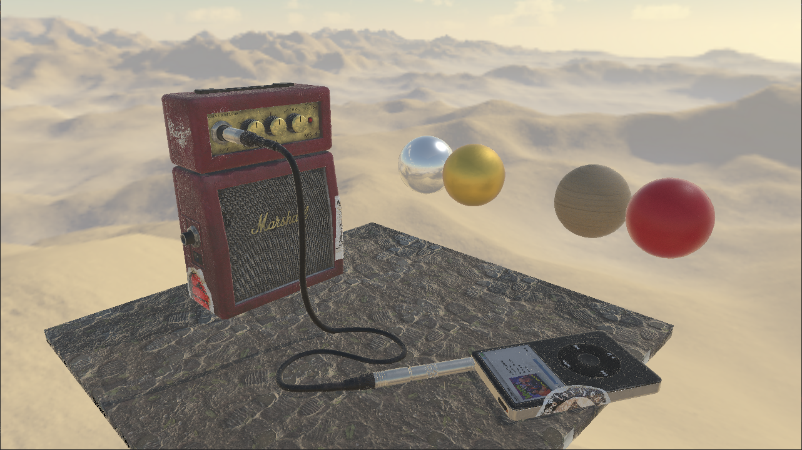

# opengl-engine

OpenGL, 3D Renderer framework that renders static meshes using physically based
shaders. It features model importing from 3rd party formats (using Assimp) and saving
them using a custom binary format that contains only the necessary data to render them in-engine.

## Building

### Platforms

This project currently supports Windows 10+, 64-bit platforms only. The included
solution and project files are intended for use with Visual Studio 2022 and should build correctly out of the box (assuming dependencies are present). Inspecting the `.sln` and `.vcxproj` files can give insight into setting up a CMake project.

### Dependencies

The full list of dependencies used is given below. Using `vcpkg` to install these is recommended. If not using Visual Studio and `vcpkg` to manage local C++ libraries, you may need to do additional steps to get builds to work.

- [Open Asset Importer Lib](https://github.com/assimp/assimp)
- [GLFW3](https://www.glfw.org/)
- [GLM](https://github.com/g-truc/glm)
- [Glad GL Loader-Generator](https://glad.dav1d.de/) (Included)
- [STB](https://github.com/nothings/stb)

## Loading your own assets

If you want to modify the code to load your own assets, the best way to do so
is to import a model into Autodesk Maya, and use a Phong shader as the material.
The setup for base color and normal maps (use as tangent space normals) should be
straightforward. Roughness maps should be set to Specular Color and metallic maps
should be set to Cosine Power (both are under Specular Shading).
If you use another tool similar to Maya with an analagous material system, it may
be loaded properly if set up in this way. Most programs don't seem to export PBR materials in model file formats (fbx, 3ds, etc.) so using something like Maya's Stingray PBS material won't work.

### TODO

- Create a streamlined process for preparing models for import that works with any
  modeling tool, or document alternatives, such as Blender (likely involving saving models in glTF format)
- Skeletal animation
- Other features of a full-fledged game/simulation/rendering engine, including particle effects

### Notes

This project was originally submitted as my final project for CS 114 (Projects in Advanced 3D Computer Graphics). From time to time I may update the code to add new features or fix compatibility issues.
